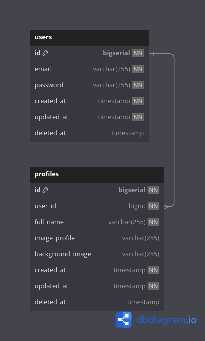

# User Service

## Overview
The **User Service** is a core component of the platform, responsible for managing user accounts. It handles user registration, profile management, and verification processes, ensuring the secure handling of user data.

## Responsibilities
- **User Registration**: Facilitates the creation and validation of new user accounts, ensuring that all required data is provided and meets validation criteria.
- **Profile Management**: Provides users with the ability to view and update their profile information, including personal details such as name, email, and phone number.
- **User Verification**: Implements necessary verification steps, such as email or phone verification, to authenticate users and secure their accounts.

## Technologies
- **Go**: The service logic and APIs are implemented in Go, leveraging its efficiency and concurrency capabilities to handle user management operations.
- **PostgreSQL**: User data, including credentials and profile information, is securely stored in a PostgreSQL database. The database is designed to ensure data integrity and security, with encryption and secure access controls in place.
- **Kafka**: cdc data users table

## table erd
